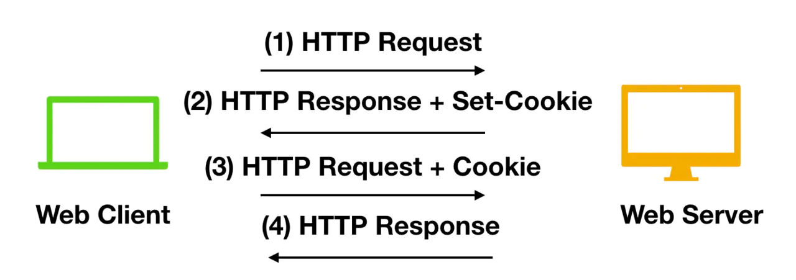
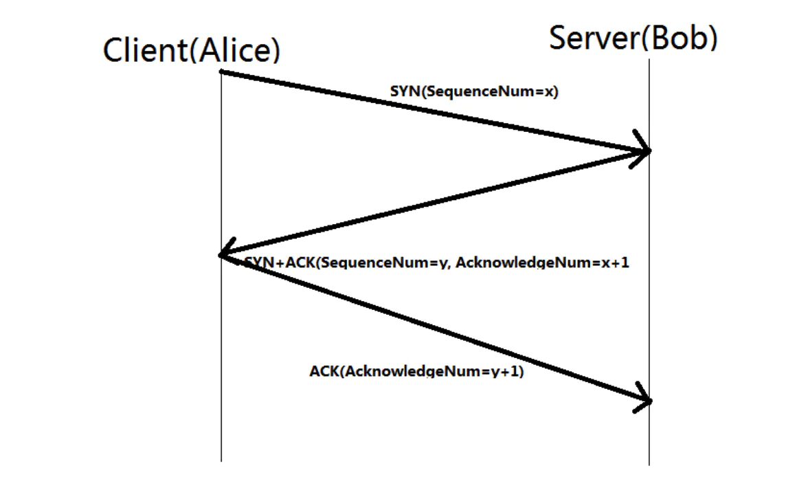
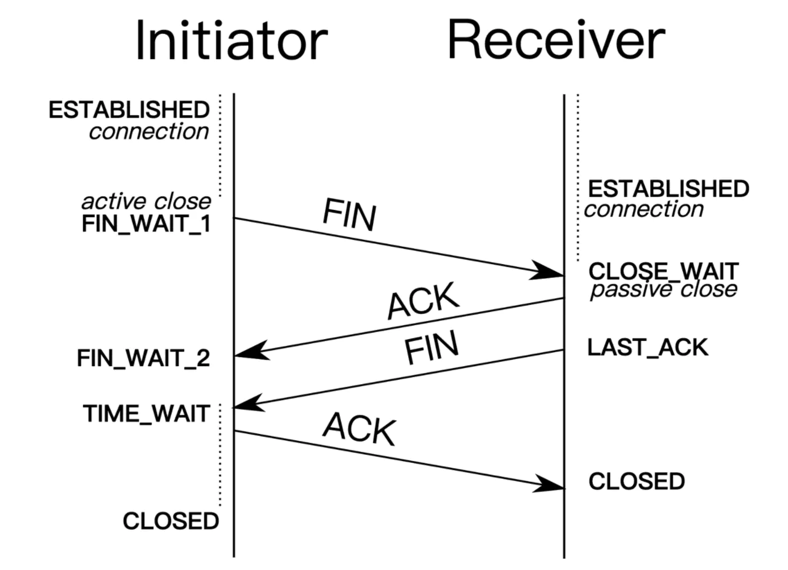

# 计算机网络

https://juejin.im/post/5e9cda81e51d4547092219fa
## http 和https区别
http 超文本传输协议，是一个在计算机世界里面在两点之间传输文字，图片，视频等超文本数据的约定和规范。
提到http协议，就不得不提TCP/IP网络模型。一般是五层模型。分别是：物理层，数据链路层(MAC)，网络层(IP,ARP)，传输层(TCP,UDP)，应用层(HTTP,SMTP,FTP)

而https的全称是安全的超文本传输协议，实际上，https不是一个新的应用层协议，而是http + tls/ssl 协议组合而成的。tls + ssl保证安全性。也就是说 https是身披一层ssl的http。
那么 http 和https的区别是什么呢？
- 在地址栏上的请求头不一样。https://开头 和 http://开头
- http是没有经过安全加密的协议，他在传输过程中容易被攻击者监听，容易发生伪造，而https是安全的协议，他通过一些加密算法能够解决上面的问题
- http默认端口是80 https默认端口是443

## http get  和post的区别

- get方法一般是用于请求，他是请求服务器返回资源，而post则是提交表单给服务器，然后等待服务器发出响应。get相当于是一个pull的操作，post相当于是一个push的操作。
- get方法是不安全的，因为你再发送请求的过程中，你的参数会被拼接到url后面，从而导致被窃取。但是post是吧参数放到body中的，对用户来说不可见。
- get请求的url有长度限制，post没有长度限制
- get请求在浏览器上反复的回退/前进操作是无害的，但是post会再次提交请求。
- get请求在发送过程中会产生一个tcp数据包，post在发送过程中会产生两个tcp数据包。对于get方式的请求，浏览器会把header和data一起发送出去，服务器返回200。而post是浏览器先发送header，然后服务器相应100之后，在发送data，然后返回200

## 无状态协议
无状态协议就是指浏览器对于事务的处理没有记忆能力，就是客户端请求一次网页后，关闭浏览器，在登录该网站，服务器并不知道客户关闭了一次浏览器。

http就是一种无状态协议。对用户操作没有记忆能力。当你输入一次密码之后不需要输入第二次是因为cookie的机制。他让浏览器有记忆能力。，
当向服务端发送请求的时候，服务端会发送一个认证信息，服务器第一次接收到请求的时候，会创建一个session对象，同时生成一个sessionid，并返回给客户端，要求客户端设置cookie的响应，当客户端收到响应之后，在本机客户端设置一个sessionid = *** 的cookie信息，这个cookie的过期时间是浏览器会话结束。接下来客户端每次想同一个网站发送请求的时候，请求头都会带上cookie信息，这样服务器读取到这个cookie信息，才具有了记忆能力。

## udp 和tcp的区别
tcp和udp都是位于五层协议中的传输层，他们负责传输应用层产生的数据。

### udp
udp的全称是 user datagram protocol。用户数据报协议。他不需要握手操作，加快了通信速度，允许网络上的其他主机在接收方同意通信之前进行数据传输。
udp的主要特点有：
- udp能够支持容忍数据包丢失的带宽密集型应用程序
- udp具有低延迟的特点
- udp能够发送大量的数据包
- udp能够允许dns查找，dns是建立在udp之上的应用层协议

### tcp
tcp transmission control protocol。传输控制协议，他通过三次握手来建立tcp连接，三次握手用来启动和确认连接的过程
tcp的主要特点有：
- tcp能够确保连接的建立以及数据包的发送
- tcp支持错误重传机制
- tcp支持拥塞控制，能够在网络拥堵的情况下延迟发送

### tcp 和udp的不同
- tcp是面向连接的协议，udp是无连接的
- tcp再发送数据之前需要建立连接，udp不需要建立连接就可以发送数据
- tcp传输的速度慢，udp传输的速度快
- tcp是可靠的，udp不可靠的
- tcp有握手协议，udp没有握手协议
- udp是面向报文的。tcp是面向字节流的
- udp支持一对一，一对多的交互通信，tcp只能一对一
- udp首部开销小，仅有8个字节，tcp首部最小20个字节，最大60个字节

## tcp三次握手和四次挥手
### tcp三次握手
tcp三次握手对应的是tcp的建立连接的过程。
- 首先，客户端在和服务端进行连接的时候，会随机生成一个SYN = x，同步序列编号，发送给服务端。
- 服务端收到这个SYN之后，会返回给客户端 一个ACK + SYN.这里的ack 就是 x + 1, 是为了应答回复客户端，然后同时发送一个SYN，是服务端自己生成的一个随机数y
- 客户端收到ACK + SYN 之后，返回给服务端一个 y+ 1。到此，连接成功

### tcp 四次挥手
tcp四次挥手对应着的是tcp释放连接的过程。
- 首先，客户端向服务端发送一个FIN，作为释放连接的信号，同时，将自己的状态同步成FIN_WAIT_1.会等待服务端的ack的响应
- 服务端收到FIN之后，返回给客户端一个ack，表示确认。
- 当客户端收到ack之后，客户端进入FIN-wait_2状态，等待服务端发送FIN.
- 服务端发送完ACK一段时间可以进行关闭之后，会发送FIN 给 客户端，告诉客户端 可以进行关闭
- 当客户端收到服务端发送过来的FIN消息的时候，客户端就会把状态改成TIME_WAIT状态，然后发送ack到服务端。然后双方关闭连接。

为什么需要进入time_wait状态？
- 如果最后一次的ack丢失的话，服务端不能正常进行关闭，这时候需要超时重传
- 客户端在发送完最后一个ack之后，保证此次连接的所有数据都从网络中消息，试下一次连接的时候不会出现旧的报文段

### tcp为什么需要三次握手，两次不可以么？
主要是为了防止已经失效的连接请求报文突然有传送到了B，因此产生资源的浪费。当A 有一个请求经过长时间的网络滞留之后，才到达服务端，此时服务端会认为A又发出了新的请求，于是A发送确认，同意建立连接，如果不采用三次握手，只要服务端确认，就建立新的连接，此时服务端会一直等待客户端发送数据，会造成浪费

### 为什么连接的时候是三次握手，关闭的时候是四次挥手？
因为当服务端收到客户端的请求连接syn报文的时候，可以直接发送syn + ack，但是关闭连接的时候，server端收到fin报文的时候，很可能不会立即关闭socket，所以只能先回复一个ack，告诉你我收到了，等到server所有的报文发送完了，我才能发送fin报文。因此不能一起发送。

## 从地址栏输入url回车之后发生了什么？
- 输入地址
- 根据地址栏输入的地址进行dns解析成ip地址
- 根据ip地址和服务器建立连接
- 客户端向服务端发送http请求，如果有重定向，就再次发送请求
- 服务器收到请求并返回相应http请求，生成html代码返回给浏览器
- 浏览器进行渲染显示
- 关闭连接

