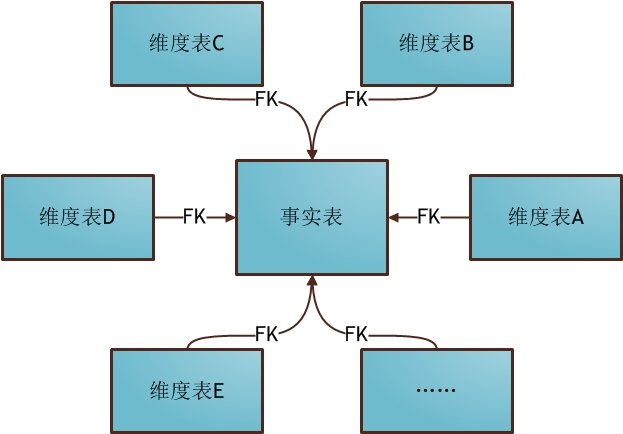
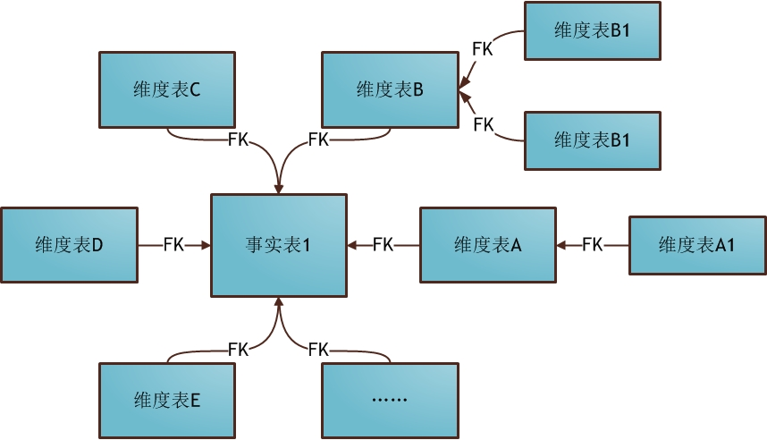
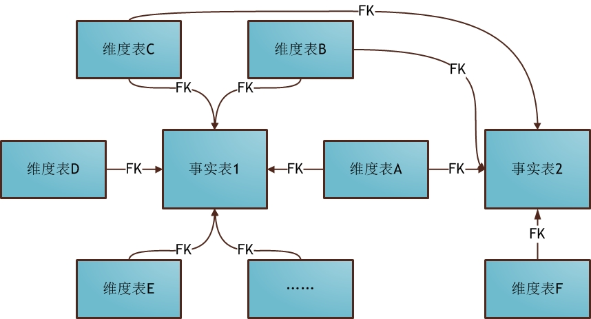

- [数据仓库理论知识](#数据仓库理论知识)
    - [常用数据建模方法](#常用数据建模方法)
        - [ER建模技术](#er建模技术)
        - [关系建模技术](#关系建模技术)
        - [维度建模技术](#维度建模技术)
            - [星型模式建模](#星型模式建模)
            - [雪花模式建模](#雪花模式建模)
            - [星座模式建模](#星座模式建模)
        - [维度建模的模型选择](#维度建模的模型选择)

# 数据仓库理论知识

## 常用数据建模方法

### ER建模技术

### 关系建模技术

### 维度建模技术
维度建模按照表可划分为事实表和维度表。
- 事实表:事实表是存储主题的主干内容的，保存度量值的详细值或者事实。通常会包含大量的行。事实表就是你要关注的内容。
- 维度表: 维， 是分析问题的角度。维度表是将事实表中一些可以进行分类的列单独拿出来，进行分类，形成维度表。比如说 事实表中记录的是一个商场卖出去的鞋子的记录。那么维度表中可以维护鞋子的种类相关信息。通常来说 维度表的行数不会太多。

通常来说，在事实表中维护事实和维度的关系。
例如，某地区商品的销量，是从地区这个角度观察商品销量的。事实表就是销量表，维度表就是地区表。

1. 维度表的冗余很大，主要是因为维度一般不大(相对于事实表来说的)，而维度表的冗余可以使事实表节省很多空间。
2. 事实表一般都很大，如果以普通方式查询的话，得到结果一般发的时间都不是我们可以接受的。

#### 星型模式建模
星型模式是最常用的维度建模方式，星型模式的维度建模由一个事实表和一组维度表构成。具有以下特点：
 - 维度表只和事实表进行关联，维度之间没有关联
 - 每个维度表的主键是为疑似的，且该主键存放在事实表中，作为两边连接的外键。
 - 以事实表为核心，维度表围绕事实表呈星星状分布。

#### 雪花模式建模
雪花模型是对星型模型的扩展。每个维表可以继续向外连接成多个子维表。

星型模型比雪花模型要大很多，雪花模型相当于将星型模式的大维度表拆解成了小维度表。

对于雪花模型，维度表的设计更加规范，一般符合3NF；而星型模型，一般采用降维的操作，利用冗余来避免模型过于复杂，提高易用性和分析效率

#### 星座模式建模

星座模式也是星型模式的扩展，星座模式会存在多个事实表，同时一个维度表也会被多个事实表用到。

### 维度建模的模型选择
- 首先就是星座不星座这个只跟数据和需求有关系，跟设计没关系，不用选择。
- 星型还是雪花，取决于性能优先，还是避免冗余、灵活更优先。
- 目前实际企业开发中，不会绝对选择一种，根据情况灵活组合，甚至并存（一层维度和多层维度都保存）。但是整体来看，更倾向于维度更少的星型模型。尤其是hadoop体系，减少join就是减少shuffle，性能差距很大。（关系型数据可以依靠强大的主键索引）