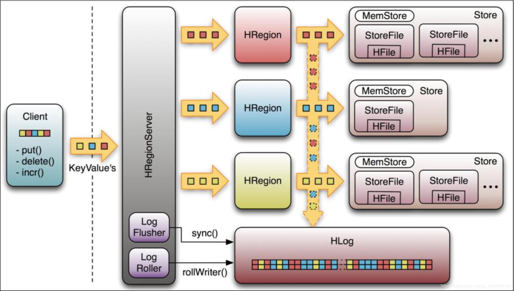
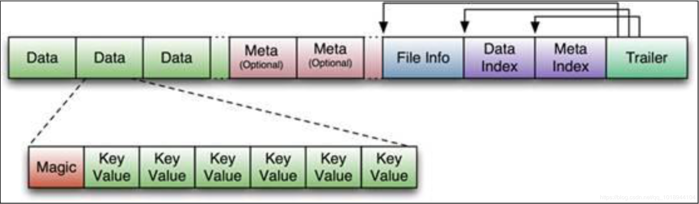

# Hbase

##  HBASE的row key 设计原则

-   row key不能为空且唯一
-   row key长度，row key 是一个二进制流，建议越短越好，最好不超过16字节，因为，数据持久化文件Hfile 是按照key value存储的，如果row key太长的话，就会影响hfile的存储效率。memstore将缓存数据到内存，如果rowkey字段过长，内存的有效使用就会降低，系统无法缓存更多的数据，降级检索效率。
-   row key 散列原则。如果row key 是按照时间戳方式递增的话，不要将时间放在二进制编码的前面，建议将row key的高位作为散列字段，如果没有散列字段的话，就会出现一个regionServer堆积的热点现象。

## HBASE 的zookeeper 作用

- 首先，zookeeper能够选举master，提供hbase的故障转移机制
- zookeeper存储了 -ROOT-表的位置信息，-root-表在哪台服务器上
- zookeeper实时监控所有的RegionServer, 并把RegionServer的所有的上线下线信息发送个master
- 存储hBASE 的schema。包括有哪些table，包括每个table 有哪些column family
  
## HBASE master的作用
- 为regionserver分配region
- 负责regionserver 的负载均衡
- 发现失效的regionserver并重新分配上面的region
- hdfs上的垃圾文件回收
- 处理schema更新请求(表的创建，删除，修改，列簇的增加等等)
  
## HBASE RegionServer 的作用

-  RegionServer维护master分配给他的region，处理这些region的IO请求
-  负责和底层文件hdfs进行交互，存储到hdfs上
-  负责store中的hfile的合并工作
-  RegionServer负责split在运行过程中变得很大的region，负责compact操作
  
**可以看到，client访问hbase上的数据并不需要master的参与，寻址访问zookeeper和RegionServer，数据读写访问RegionServer，master仅仅起到维护原信息的作用，负载很低**
**.META.表存储的是所有region的位置信息，那么当产生新的region时，由master进行分配到哪个RegionServer上，所有，有master维护.META.表的curd**

**所以，在没有region宕机的时候，master宕机一段时间是可以忍受的**

## hbase物理结构

- TABLE 中的所有行都按照rowkey的字典序排列
- TABLE 在行上分隔成多个region
- region是按照大小来分隔的，每一个表最开始只有一个region，随着数据的不断增加到一个阈值的时候，就会分成两个region
- region是hbase中负载均衡的最小单元，不同的region分布在不同的regionserver上，但是一个region不会拆分到不同的regionserver上
- region是负载均衡的最小单元，但不是物理存储的最小单元，实际上，region有一个或者多个store组成，每个store保存一个column family。每个store又由一个memstore和0-多个storefile组成。

### storefile和Hfile的结构

- Hfile文件是不定长的，长度固定的只有两快，trailer和Fileinfo。Trailer中有指针指向其他数据块的起始点。FileInfo中记录了文件的一些meta信息。
Hfile分为六部分：
 * Datablock。 保存表中的数据，这部分可以被压缩
 * MEtaBlock 保存用户自定义的kv对，可以被压缩
 * FileInfo Hfile的原信息，不被压缩，用户也可以在这一部分添加自己的元信息
 * DATA BLOCK INDEX .data block的索引，每条索引的key是被索引的block的第一条记录的key
 * meta block index  meta block 的索引
 * Trailer.这一部分是定长的，保存了每一段的偏移量。读取一个hfile时候，首先会读取trailer，trailer保存了每个段的起始位置，然后data block index 会被读入到内存中，当检索某个key的时候，不需要扫描整个hfile，只需要从内存中找到key所在的block，然后通过一次磁盘io将整个block读取到内存中，在找到需要的key。datablock index采用的是LRU机制淘汰

### Hlog（WAL）
WAL 意为write ahead log 用作灾难恢复之用。hlog记录数据的所有变更，一旦数据修改，就可以从log中恢复
每个regionServer都维护一个Hlog. 这样不同的region日志会混在一起，这样做的目的是不断追加单个文件可以减少磁盘寻址次数，提高写性能，但是麻烦的是，如果一台region下线，为了恢复这个region，需要把regionserver的log进行拆分，然后分发到其他regionserver上进行恢复。

## hbase寻址机制

### 老的region寻址方式

    在hbase0.96版本之前，hbase有两个特殊的表，分别是-ROOT-和.META.表。其中-ROOT-表的位置存储在zookeeper上， -ROOT-本身存储了.META.表的regioninfo信息，并且-ROOT-不会分裂，只有一个region。而.META.表可以被分裂成多个region。

详细步骤：
- 首先client向zookeeper发送请求，请求获取存储-ROOT-的regionserver地址
- client请求-ROOT-的regionserver地址，获取.META.表的地址，client会把相关信息缓存下来，以便下一次访问
- client请求.META.表的regionServer地址，获取数据所在的RegionServer地址，client也会缓存相关信息
- client访问数据所在的REGIONserver地址，获取数据
  设计三层的主要原始是考虑到元数据可能需要很大。但是通过计算 发现2层已经能够满足集群的要求了，所以在0。96版本那之后就去掉了ROOT表

### 新的region寻址方式
详细步骤
- Client请求zookeeper获取.META.所在的regionServer地址‘
- client 请求.META.所在的RegionServer，获取访问数据所在的regionSERVER地址 client 会缓存对应的信息
- client请求数据所在的rEGIONserver。获取数据
  
  *去掉-ROOT-原因有两点1.提高性能 2.2层结构已经满足要求*

client 什么时候更新呢？ client会根据缓存访问，如果发生错误的了，达到重试次数后，就会从meta所在的regionserver重新获取数据。

## hbase 读请求过程

- client通过zookeeper 以及root表和meta表获取到对应数据所在的RegionServer
- client 通过RegionServer查询数据
- RegionServer定位数据所在的region，发出查询请求
- region首先在memstore上查找，命中则返回
- 如果在memstore中找不到，就去storefile中扫描。为了快速判断查询的数据是否在storefile中，可以使用boolfilter。

*boolfilter: 能够迅速判断一个元素是否在一个庞大的集合内，有误判率。原本不存在该集合的元素，boolfilter可能判断他存在，但是如果boolfilter说他不存在，那么久一定不存在*

## hbase 写请求过程

- client首先根据rowkey 找到对应的region所在的regionserver。
- client向RegionServer发送写请求
- RegionServer找到对应的region
- Region 检查数据是否和schema一致
- 如果客户端没有指定版本，则获取当前系统时间作为数据版本
- 将更新写入wal log
- 将更新写入memstore
- 判断memstore是否需要flash为storefile文件

**Hbase在做数据插入操作时，首先要找到 RowKey 所对应的的 Region，怎么找到的?其实这 个简单，因为.META.表存储了每张表每个 Region的起始RowKey了。**

**做大量数据插入的时候，避免出现递增row key的put操作，因为会造成数据热点现象**

### 细节描述 hbase对memstore 和 storefile 存储对表的更新

    数据在更新的时候，首先会写入wal log，在写入memstore中，memstore中的数据是排序的，当数据累积到一定阈值的时候，就会创建一个新的memstore，然后将老的memstore flush到磁盘上，成为一个storefile。

    storefile是只读的，因此hbase 的更新和修改其实是不断追加的操作，当一个store中的storefile达到阈值后，会进行一次compact，将对同一个key的修改合并到一起，形成一个大的storefile，当storefile 的大小达到阈值后，会把storefile split，分成两个 storefile。

compact分为两种：
- minor_compact.  
    minor_compact 只是用来作部分文件的合并
- major_compact 对region下的store下的所有storefile执行合并操作包括删除，超过ttl的数据，最终的结果会整理合并出一个文件。

什么时候执行compact呢：(调用compact的时候会自动决定执行哪种compact)
- memstore 刷新到磁盘上的时候
- 用户调用相关api的时候
- hbase自己周期性检查的时候
  

Client 写入 -> 存入 MemStore，一直到 MemStore 满 -> Flush 成一个 StoreFile，多个storefile 文件达到一定大小增长到 一定阈值 -> 触发 Compact 合并操作 -> 多个 StoreFile 合并成一个 StoreFile，同时进行版本 合并和数据删除 -> 当StoreFilesCompact后，逐步形成越来越大的StoreFile-> 单个StoreFile大小超过一定阈值后，触发 Split 操作，把当前 Region Split 成 2 个 Region，Region 会下线， 新 Split 出的 2 个孩子 Region 会被 HMaster 分配到相应的 HRegionServer 上，使得原先 1 个Region 的压力得以分流到 2 个 Region 上

**hbase只是增加数据，所有的更新和删除数据，都是在compact操作的**

## hbase高级属性

### 建表高级数据

#### boolfilter
    布隆过滤器可以每个列簇单独启用
    使用布隆过滤器可以节省读磁盘空间，降低读取延迟’
#### versions
    默认是1，这个参数的意思是把数据保留一个版本。
    附：MIN_VERSIONS => '0'是说在 compact 操作执行之后，至少要保留的版本，只有在设 置了 TTL 的时候生效

#### compresssion 压缩
    建议采用snappy算法
#### ttl
    列簇的数据存活时间，超过该存货时间的数据将不再显示，下次major compact彻底删除数据。
#### hbase 预分区
    默认情况下，创建表的时候回自动创建一个region分区，当导入数据的时候会先向一个region写数据，知道变大了裁切分，一种可以加快批量写入数据的方法是提前创建一些空的regions，这样写入的时候 会按照region分区情况，在集群内做负载均衡

## 防止数据热点的有效措施
- 加盐
    在row key前面加随机数。
- 哈希
- 翻转
  翻转固定长度或者数字格式的row key。能够有效的随机row key。
- 时间戳翻转

## LSM-TREE
    传统型关系型数据库使用一些b+ tree 作为存储结构，能够高效的进行查找，但是保存到磁盘的时候，他有一个明显的缺陷，就是逻辑上相离很近的数据，物理上却相隔很远，这就造成大量的随机磁盘IO读写，随机读写比顺序读写慢得多。

    LSM tree 则是一种对写优化的系统，将随机写转化成顺序写，从而获得优秀的写性能。
    LSM TREE 包括 memtable ，immutable memtable，sstable
    memtable是在内存中的数据结构，用以保存最近的一些更新操作，memtable可以使用跳跃表或者搜索树等数据结构来组织数据以保持数据的有序性。当memtable达到一定的数据量后，memtable会转化成为immutable memtable，同时会创建一个新的memtable来处理新的数据。