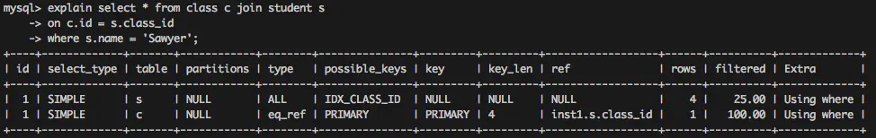
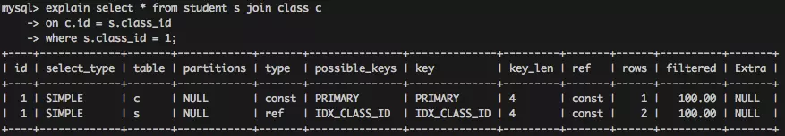

# MySQL执行计划


## Mysql执行计划概念

首先，mysql 执行计划会有如下几个字段：

| id | select_type|table|partitions|type|possibile_keys|key|key_len|ref|rows|filtered|extra|
|--|--|--|--|--|--|--|--|--|--|--|--

- id 表示执行的顺序。id越大越先执行，id相同从上往下执行。
- select_type 表示查询类型。通常有：
    * simple。表示不需要union或者不包含子查询的简单查询
    * primary。表示最外层查询
    * union union操作找那个第二个及以后的查询。
    * dependent union。union操作中第二个及之后的查询，并且该查询依赖外部查询。
    * subquery 子查询中的第一个查询
    * dependent subquery 子查询中的第一个查询，且该查询依赖于外部查询
    * derived。派生表查询，即from子句中的子查询
    * materialized 物化查询
    * uncacheable subquery。无法被缓存的子查询，对外部查询的每一行都需要重新进行查询。
 - table 表名或者表的别名
 - partitions 分区信息
 - type 访问类型，表示找到所查询数据的方法。该属性常见值如下，性能从好到差：
    * NULL。不使用索引或者不需要访问表，比如获取一个索引的最大值或者最小值。
    * system/const。system是const的一种特殊情况。即表中只有一条数据。const，  当查询最多匹配一行时，比如where id = 5的情况。
    * eq_ref。多表关联查询时，根据唯一非空索引查询的情况。
    * ref 多表查询时，根据非唯一非空索引查询的情况
    * range 在索引上进行范围查找
    * index 遍历索引查询，通常发生在查询结果只包含索引字段时候
    * ALL 全表查询，最差的情况
- possibile_keys表示这次查询可能使用到的索引
- key 实际使用到的索引
- key_len 表示索引的长度。该值越小越好
- ref 表示连接查询的连接条件
- rows 此次查询所需读取的行数
- extra 表示mysql解决查询的其他信息 
  
## 实际讲解相关的字段

DDL:
```
CREATE TABLE class (
id int(10) unsigned NOT NULL AUTO_INCREMENT,
grade int(11) NOT NULL,
PRIMARY KEY (id)
);
```
```
CREATE TABLE student (
id int(10) unsigned NOT NULL AUTO_INCREMENT,
name char(20) NOT NULL,
age tinyint(4) NOT NULL,
score tinyint(4) NOT NULL,
class_id int(11) NOT NULL,
PRIMARY KEY (id),
KEY IDX_CLASS_ID (class_id),
KEY IDX_AGE (age)
);
```
建立两张表。下面分析type类型一列。
- NULL:无需访问表或者索引，比如获取一列的最大值或者最小值，因为索引存储是B+树的存储结构，B+树的叶子节点是按照顺序排列的，所以查询最大值或者最小值的时候，直接拿头结点或者尾节点就可以。比如
```
select max(age) from student;
```

- system/const:当查询最多匹配一行的时候，常见于where 条件=(常量)的情况。
```
select * from student where id = 1;
```
- eq_ref: 多表关联查询的时候，根据唯一非空索引进行查询的情况。这个只会出现在关联查询中，并且是根据唯一非空键（主键或者唯一非空索引）查询的情况。如下：
```
select * from class c join student s
on c.id = s.class_id
where s.name = 'Sawyer';
```

这里的执行结果出现了两条数据，id同为1，回忆一下我们一开始说的，id代表了执行的顺序，当id相同时，顺序自上而下。所以分析这个执行结果可知，mysql首先在s表也就是student表中查询name字段为Sawyer的值，由于name字段上并没有索引，所以使用了全表扫描，该表一共有4条记录，所以扫描了4行，rows为4。然后c表也就是class表使用主键和之前的结果通过s.class_id关联，由于是关联查询，并且是通过唯一键进行查询，所以使用了eq_ref的类型。这里也可以通过建立name字段的索引来优化全表扫描的问题，这里就不再演示
- ref 多表查询的时候，根据非唯一非空索引进行查询的情况，
```
select * from class c join student s
on c.id = s.class_id
where c.id = 1;
```

通过这个执行计划可以分析出，由于查询条件是c.id=1,是一个常数查询，mysql首先使用const对c表进行查询，之后s表使用索引IDX_CLASS_ID对结果进行关联，由于索引IDX_CLASS_ID是非唯一非空索引，所以这里的查询方式为ref。

- range 在一个索引上进行范围查找。比如between 
```
select * from student where age between 20 and 30;
```
- index 通常发生在查询结果只包含索引字段时。没有where条件。
```
select id from student;
```

- ALL 全表扫描，没有任何索引可以使用的时候。最差，应该避免

EXTRA:

- USING index
  该值表示相应的select操作中使用了覆盖索引
- Using where
  表示Mysql服务器在存储引擎收到记录后，进行过滤。如果查询未能使用索引，Using where的作用只是提醒我们MySQL将用where子句来过滤结果集
- Using temporary
    表示mysql需要临时表存储结果集，常见排序和分组查询
- using filesort
   mysql无法利用索引完成的排序。


