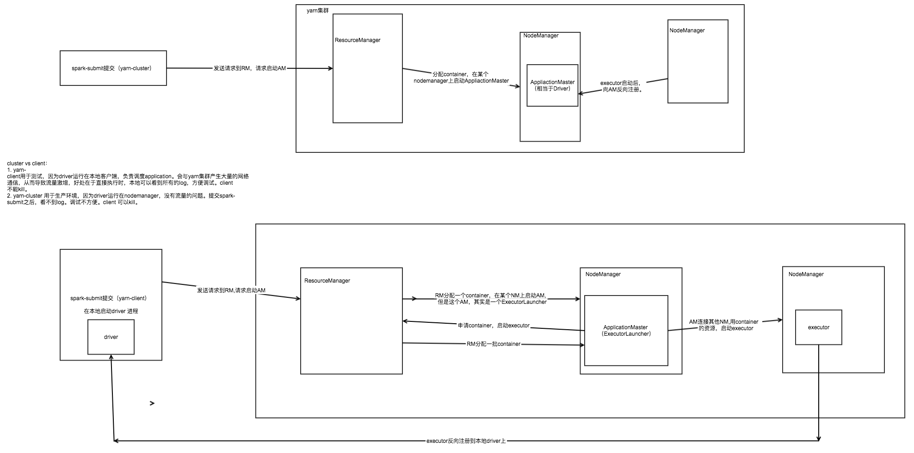

# yarn-cluster vs yan-client

启动流程：
- spark-cluster
首先，spark -submit启动的时候会去请求resource manager，然后resourcemanager会在某个nodemanager上启动一个applicationmaster，这个applicationmaster就相当于是driver，后续的资源申请就有applicationdriver来负责，这个时候就可以关掉client。作业会继续在yarn上进行。

- yarn-client
  yarn-client的applicationmaster只会申请资源，申请资源后，executor会和本地的driver进行交互，而不是和am进行交互。
  yarn-client会在本地启动一个driver，通过本地的driver来和executor进行通信。会产生大量的网络传输，client不能kill
  所以说 yarn-cluster适合生产环境 不适合运行交互类型的作业  yarn-client适合交互以及调试