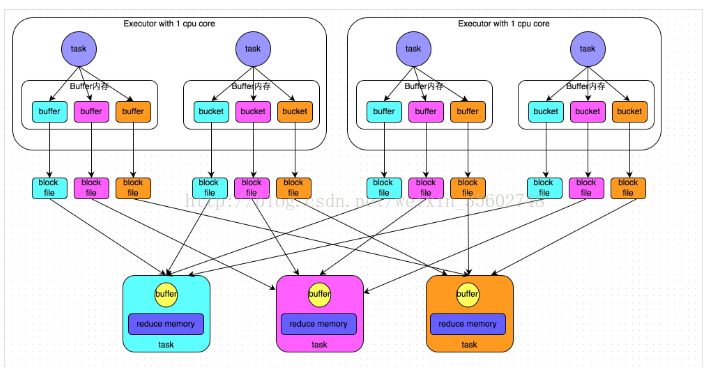
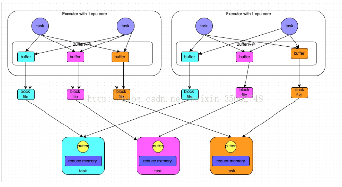
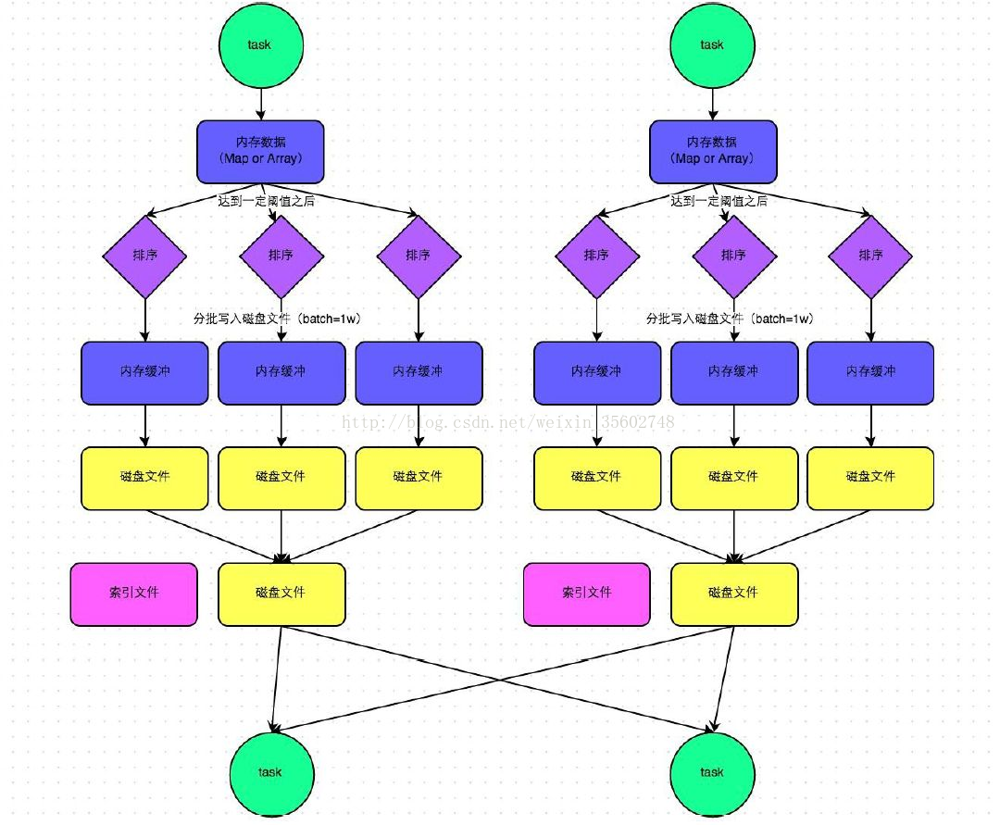
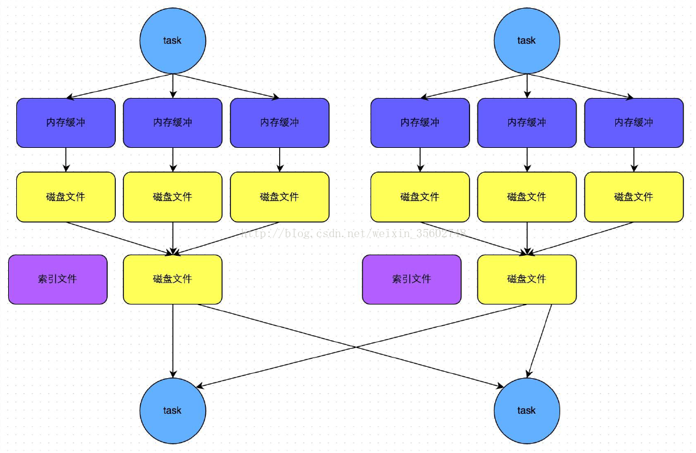

# spark shuffle

## shuffle概念

    由于spark在DAG阶段会把一个job划分成多个stage，上游的stage做map工作，下游的stage做reduce工作，shuffle就是连接map和reduce之间的桥梁，他把map的输出对应到reduce的输入当中这期间涉及到了序列化，反序列化，跨节点网络，以及磁盘IO等，所以说shuffle是整个应用程序运行过程中最昂贵的阶段

    在spark1.2版本之前，默认的shuffle计算引擎是hashshuffle，这种计算引擎有一个非常严重的弊端，就是产生大量的磁盘文件，进而产生大量的磁盘IO影响性能。于是在1.2以后的版本中，默认的shuffle改成了sortshuffle。sortshuffle相比较于hashshuffle来说，每个task在进行shuffle操作的时候，虽然会产生多个临时文件，但是最后会把所有的临时文件合并成一个磁盘文件，这样，每个task就只有一个磁盘文件，在下一个stage的shuffle read task 拉去自己的数据的回收，只要根据索引读取每个磁盘文件中的部分数据即可。

## Hash shuffle

Hashshuffle运行机制有两种，一种是普通的运行机制，一种是合并的运行机制。 合并机制主要是通过复用buffer来优化shuffle过程中产生的小文件的数量，hashshuffle是不具有排序的shuffle。

### 普通机制的shuffle

普通机制的hashshuffle如下图所示。

我们假设，每个executor只有一个cpu core。也就是说，无论这个executor上分赔多少个task线程，同一时间只能执行一个task线程。

图中有3个reducer，每一个shufflemaptask会为每一个reducetask创建一个bucket缓存，并且会为每一个bucket创建一个文件，这个bucket存放的数据就是经过partitioner操作之后找到对应的bucket然后放进去，最后将数据bucket缓存到磁盘上，生成对应的blockfile。

每1个task输出3分本地文件，4个mapper tasks，所以一共输出 4*3 = 12 个本地小文件

- shuffle write 阶段

主要就是在上一个stage结束计算后，为了下一个stage可以执行shuffle类的算子，比如reduceBykey，groupBykey等，将每个task处理的数据按照key分区。所谓分区，就是将相同的key执行hash算法，从而吧相同的key写入到同一个磁盘文件中，而每一个磁盘文件都只属于reduce端的stage的一个task，在写入磁盘之前，数据线写入内存缓存中，当缓冲填满之后，才会溢写到磁盘文件中。

那么内个执行suffle write的task，要为下一个stage创建多少个磁盘文件呢？就是下一个stage 的task有多少个，当前stage 的每个task就要创建多少个磁盘文件，比如下一个stage有100个task，若果当前stage有50个task，那么就需要创建5000个文件。

- shuffle read 阶段

shuffle read。就是一个stage刚开始要做的事情，此时，这个stage的每一个task就需要吧上一个stahe计算结果中相同的key，从每个节点通过网络拉取到自己的节点上，然后进行key 的聚合和连接操作。

shuffle read的拉取过程是一边拉取一边进行聚合的，每一个shuffle read task都会有自己的一个buffer 缓冲，每次只拉取和缓冲相同大小的数据，然后通过内存中的map进行聚合操作，聚合完之后再拉下一批数据。

*注意*：
- buffer起到的缓存作用，缓存能够加速写磁盘。
- block file 个数计算公式  block file = M * R M是 map task的数量，R是reduce的数量。
- 分区器：根据hash/numRedcue取模决定数据由几个Reduce处理，也决定了写入几个buffer中 一般Reduce的数量等于buffer的数量，都是由分区器决定的 ？？？？？？？？？？？？？？？分区器？？？？？？？ reduce 数量？
https://www.zhihu.com/question/40882893

#### hash shuffle 普通机制的问题
- shuffle前在磁盘上会产生海量的小文件，建立通信和拉取数据的次数变多，此时会产生大量耗时低效的IO操作，因为产生很多的小文件
- 可能导致OOM。大量低效的IO操作，导致磁盘写的时候对象过多，读磁盘的时候对象也很多，这些对象存储在堆内存中，会导致堆内存不足，导致频繁的GC，GC会导致OOM.

### 优化机制的shuffle
合并机制就是复用buffer。开启合并机制的配置是 spark.shuffle.consolidateFiles.该参数的默认值是false。将其设置为true就可开启优化机制，通常来说，如果使用hashshufflemanager，那么建议开启这个选项。

开启consolidate机制之后，在shuffle write过程中，task就不是为下游stage的每个task创建一个磁盘文件，此时就会出现shufflefilegroup的概念，每个shufflefilegroup会对应一批磁盘文件。磁盘文件的数量和下游的stage的task数量是相同的。一个executor 有多少个CPU core，就可以并行执行多少个task。第一批执行的每个task就会创建一个shuffle file task。并把数据写到对应磁盘上。

executor 的cpu core 执行完一批task，接着执行下一个task时，下一批task就会复用之前已经的存在的shufflefilegroup，包括其中的磁盘文件。这样这个机制有效将多个task‘的磁盘文件进行一定程度的合并，从而减少磁盘文件的数量。

假设第二个stage有100个task，第一个stage有50个task，总共有10个executor，一个executor有一个cpu core。没有优化之前，会有100 * 50 = 5000个小文件，开启优化机制之后，就会变成 10*100 = 1000 个磁盘小文件。
*注意*：
- 启动合并机制的配置为：spark.shuffle.consolidateFiles=true
- block file = Core * R  CORE是cpu的核数，R是reduce的数量。

#### hash shuffle合并机制的问题
如果reduce端task还是很多的话，还是会产生很多小文件

## sort shuffle
sortshuffle运行机制有两种，一种是普通的运行机制，另外一种是bypass运行机制。当shuffle read task的数量小于等于spark.shuffle.sort.bypassMergeThreshold参数的值得时候，就会启用bypass机制。

### sortshuffle普通运行机制（为什么排序？让Reducer去抓取数据的时候变得更高效）

在这种模式下，数据会先写到一个内存数据结构中，根据不同的shuffle算子，可以选用不同的数据结构，如果是reduceBykey这种聚合类的shuffle算子，会选用map数据结构，一边通过map聚合，一遍写入内存，如果是join，就直接选用array写入内存。每写一条数据到内存的数据结构之后，就会判断一下是否达到了临界阈值，如果达到的话，就会好吃那更是把内存的数据溢写的磁盘上，然后清空内存的数据结构。

在一些溢写到磁盘文件之前，会先根据key对内存数据结构中已有的数据进行排序。

排序过后，会分批的把数据写入到磁盘文件，默认的batch数量是1w条。一个task将所有数据写入到内存的数据结构的过程中，会发生多次磁盘溢写操作，也就会产生多个临时文件，最终会把之前所有的临时磁盘文件进行合并。这就是merge过程，此时，会把所有之前临时文件数据独取出来，然后依次写入磁盘文件中。由于每一个task只有一个磁盘文件，所以还会单独写一份索引文件，来标识下游各个task的数据在文件中的start offset和end offset。

*注意*：
一个map task会产生一个索引文件和一个数据大文件

### bypass机制

bypass运行机制触发条件如下：
- shuffle reduce task 数量小于 spark.shuffle.sort.bypassMergeThreshold参数的值
- 不是聚合类的shuffle算子

此时task会为每个reduce端的task都创建一个临时磁盘文件，并且数据按照key进行hash然后根据key的hash值，将key写入对应的磁盘文件之中。最后，会把所有临时文件合并成一个磁盘文件，然后创建一个单独的索引文件。

这个过程的磁盘写机制和没有优化的hashshuffle是一样的，都要创建很多的磁盘文件，只不过是在最后要进行一次合并而已。这样会让shuffle read性能会更好。

这种机制和普通的sort的机制不同点
- 写磁盘文件机制不同 一个是先写到数据结构，然后溢写到磁盘上，另外一种是根据key 进行hash，写到对应的临时文件中。
- 第二种不会进行排序，也就是说，会省掉这一部分的开销。

### unsafe shuffle
在spark1.5之后，为了进一步优化内存和cpu的使用，引入unsafe shuffle，他的做法是吧数据用二进制的方式存储，直接在序列化的二进制数据上sort而不是java对象上。一方面是减少memory个gc，另一方面是避免序列化。

但是使用有限制。一个是不能有aggregate操作，分区数不能超过一定大小。

在1.6之后会检测满足unsafe条件会自动采用unsafe。

## spark shuffle  VS hadoop shuffle

- mapreduce只能从一个map stage shuffle数据，spark可以从多个map stage shuffle数据
  
- mapreduce 是sort-based， 进入combine（）和reduce（）的数据必须先sort。早期的spark是hash-based。只有在sortshuffle的普通模式下，才会进行排序。mapreduce shuffle总共发生3次排序，分别是第一次在map阶段，数据从环形缓冲区溢出到磁盘上，落地磁盘的文件会按照key进行分区和排序，快排。第二次，在map阶段，堆溢出的文件进行combine合并过程中，需要对溢出的小文件进行归并排序，合并。第三次是reduce对文件进行归并排序。
  
- mapreduce是粗粒度，reduce fetch到records先放到shuffle buffer中，当shuffle buffer快满的时候，才对他们进行combine。而spark是细粒度。可以及时的把fetch到的record进行聚合。
- 数据结构不同。hadoop是基于文件的数据结构，spark是基于rdd的数据结构。
- hadoop shuffle会在环形缓冲区溢出到磁盘很多小文件，但是可以采用combine机制对文件进行合并。spark和shuffle类型有关。
- hadoop mapreduce的shuffle方式单一，spark针对不同类型的操作，不同类型的参数，会有不同的shuffle write方式，比如bypass，baseshuffle
- shuffle fetch后数据存放位置 hadoop reduce端把数据拉取到同一个分区，将文件进行归并，排序，然后把文件保存到磁盘上。spark是优先放入内存中

## mapreduce为什么要进行排序
首先，因为shuffle的过程就是为了将相同的key放到一起，因为reduce端需要进行分组，然后mapreduce进行了排序，通过外排，只要磁盘够大，就可以对任意数据进行分组，就避免了占用大量的reduce的内存，减轻了reduce端排序的压力。
## spark shuffle 优化

- spark.shuffle.file.buffer
  * 默认值：32k
  * 参数说明：该参数用于设置shuffle write task的bufferoutputstream的buffer缓冲大小，把数据写到磁盘文件之前，会先写到buffer缓冲中，等到缓冲满了之后，才会溢写到磁盘
  * 调优建议，如果作业内存资源比较充足的话，可以适当增大这个参数的大小，从而减少写磁盘的次数，减少磁盘io次数，进而提升性能。
- spark.reducer.maxSizeInFlight
  * 默认值 48m
  * 参数说明：这个参数用于设置shuffle read task 的buffer缓冲大小，而这个buffer缓冲决定了每次能够拉取多少数据
  * 调优建议 如果内存资源比较充足的话，可以适当增加这个参数大小，减少拉取次数，从而减少网络传输次数，提升性能。
- spark.shuffle.io.maxRetries
  * 默认值 3
  * 参数说明：shuffle read task 从shuffle write task所在节点拉取属于自己的数据的时候，可能因为网络异常导致拉取失败，时会自动进行重试的。这个参数表示可以重试的最大次数。
  * 调优建议：如果程序包含了特别耗时的shuffle操作的作业，建议增大重试次数，避免因为gc或者网络问题导致拉取数据失败，这个参数可以提升稳定性
- spark.shuffle.io.retrywait
  * 默认值 5s
  * 参数说明：每次重试拉取数据的等待间隔
  * 增大间隔时长，增加shuffle稳定
- spark.shuffle.memoryFraction
  * 默认值0.2
  * 参数说明：这个参数表示了executor内存中，分配给read task进行聚合操作的内存比例
  * 如果内存充足，很少使用持久化操作的话，调高，提供更多内存，避免因为内存不足导致频繁些磁盘
- spark.shuffle.manager
  * shufflemanager类型。1.2之前是hash，1.2之后是sort。如果需要排序的话用sort 不需要的话就调节参数，用bypass
- spark.shuffle.sort.bypassMergeThreshold
  * shuffle read 数量小于这个的时候，启动by pass，不进行排序
- spark.shuffle.consolidateFiles
  * 如果是hashmanager 开启会合并write输出文件。