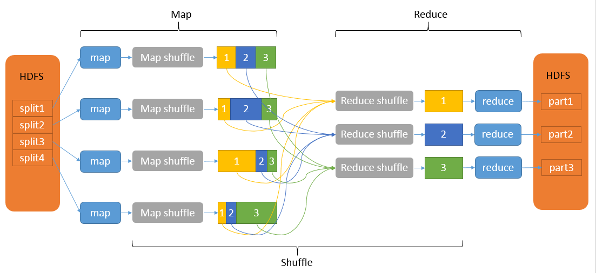
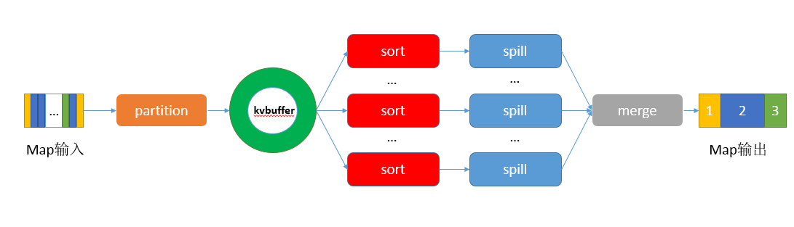

# map reduce 原理

mapreduce的shuffle分为map端的shuffle 以及reduce端的shuffle

### map端shuffle

在map端的shuffle过程是对map的结果进行分区，排序，和切割，然后把属于同一分区的输出合并在一起并写入磁盘上，最终得到一个分区有序的文件，分区有序的意思就是map输出的键值对按照分区进行排列，具有相同partition值的键值存储在一起，每个分区里面的键值对又按照key进行升序排列。

#### 分区 partition
对于map输出的每一个键值对，系统都会给定一个partition，partition值默认是通过计算key的hash值然后对reduce task的数量取模获得，如果一个键值对的partition为1，那么意味着这个键值对会交给第一个reduce 来处理。

如果想做到全局有序的话，可以只设置一个reduce task。另外如果每个reduce task处理的键值对数据不平衡的话 需要我们自己定义partitioner。但是必须保证具有相同key的键值对分发到同一个reducer。

**数据会先存到环形内存缓冲区中，当数据在环形内存缓冲区中存储满80MiB（默认值）时，会启动spill线程，这时会进行HashPartition分区和Key.comparaTo()排序操作（如果设置了Combiner合并组件，会将经过分区、排序后还没有溢写到磁盘的数据再进行合并，最后将合并后的数据溢写到磁盘中）**

#### collector
map的输出结果都是有collector来处理的。每个map任务不断把键值对输出到内存中构造的一个环形数据结构中，使用环形数据结构是为了更有效的使用内存空间，在内存中防止尽可能多的数据。
这个数据是一个字节数组，叫kvbuffer。这里面不仅仅有数据，还有一些索引数据，存放索引数据的取余叫做kvmeta。数据区域和索引数据区域在kvmbuffer是相邻不重叠的取余，用一个分界点划分两者，每次spill都会更新一次，初始的分界点是0。数据存储的方向是向上增长，索引数据的存储方向是向下增长。

不管怎么设置，kvbuffer的容量都是有限的，键值和索引的数量不断的增加，数据就从内存刷新到磁盘上，然后接着往内存中写数据，吧kvbuffer的数据刷新到磁盘上的过程叫spill。
#####   spill的触发条件
如果吧kvbuffer全部用完之后再开始spill，那么map任务需要等到spill完成之后才能继续写数据，所以如果kvbuffer只是写了到一定百分比，比如80% 的时候开始spill，那么spill同时，map还能继续写数据，如果spill够快，map就不需要为空闲的空间发愁。一般这个参数设置为0.8

#### SORT
当spill出发之后，sortANDSpill先把kvbuffer中的数据按照partition值和key两个关键字升序排序，排序结果是数据按照partition单位聚集在一起，然后统一partition的key升序排列。排序的是索引。

#### spill

spill线程为spill过程创建一个磁盘文件，从所有的本地目录中轮训查找能存储这么大空间的目录，然后找到之后创建一个类似于spill12.out的文件，spill线程根据排序的索引数据每个partition的数据刷新到这个文件中，一个partition数据刷新完之后顺序的吐下一个partition。知道所有的partition都遍历完。一个partition在文件中对应的数据也叫做segment。在这个过程中，如果用户配置了combiner，那么会在写之前先调用combineandspill()。对结果进行进一步合并然后写入文件，Combiner会优化mapreduce的中间结果，所以说如果是累加或者是最大值的话可以使用combiner，如果是求平均值的话 就慎用

所有partition对应的数据都放在这个文件中，虽然是顺序存放的，但是怎么知道某个partition在这个文件中存放的起始位置呢？这个时候就会有个索引。有一个三元组记录某个partition对应的数据在这个文件中的索引。起始位置，原始数据长度，压缩之后的数据长度。如果内存中存不下索引的信息的话 就会写到磁盘中，然后也是从本地目录中轮训查找能存储这么大空间的目录，然后创建一个类似于spill12.out.index 的文件。如果内存中存放改的下的话，就不需要存放到磁盘上，

spill进行的时候，map任务会一直输出数据，会一直把数据写入到kvbuffer中，那么如果index 和数据的指针一直增长的话，就会碰头，怎么处理？map回去kvbuffer中剩余空间的中间位置，然后用这个位置设置成新的分界点， 然后再从这个分界点开始重新向两边存放数据。

#### Merge
map任务段如果输出数据量很大，可能会进行几次spill。这样文件会很多，分不到不同的磁盘上，最后需要把这些文件进行merge。

merge过程是怎么知道产生的spill文件都在哪里呢？会从本地目录扫描得到产生的spill文件，然后把路径存储起来， 同时也会扫描所有本地目录，吧索引信息存储在列表里面。然后为mger过程创建一个文件和索引文件来存储最终的输出和索引。一个partiton 一个partiton的进行合并输出。

### reduce端shuffle
在reduce端，suffle会分为复制map输出，排序合并两个阶段

#### copy
reduce任务通过http向各个map任务获取他所需要的数据，map任务完成之后，会通知taskTracker，然后通知jobtracker，对于制定作业来说，jobtracker会记录map输出和tasktracker映射关系，reduce会定期向jobtracker获取map的输出位置，一旦拿到输出位置，reduce任务就会吧数据复制到本地，不会等到所有map任务结束。

**Reducer是如何知道要去哪些机器去数据呢？一旦map任务完成之后，就会通过常规心跳通知应用程序的Application Master**

#### merge sort

copy过来的数据会先放到缓冲区，然后进行内存到内存的merge。当内存中数据占用空间达到一定程度的时候，就会内存中的数据输出到磁盘上。当所有reduce 的map端全部拷贝完成之后，会在reduce上生成多个文件，开始执行合并操作，磁盘到磁盘的merge。进行归并排序，输出成一个整体有序的数据块。

参考：   

https://blog.csdn.net/u014374284/article/details/49205885

https://blog.csdn.net/bingduanlbd/article/details/51933914